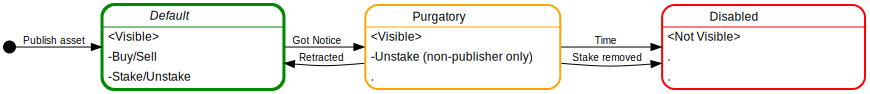
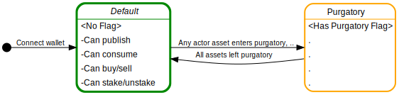

## Overview

[Ocean Market](https://market.oceanprotocol.com) is a decentralized data marketplace operated by [Ocean Protocol Foundation](https://www.oceanprotocol.com) (OPF).

This set of documents describes the policies and processes for Ocean Market around: copyright violations / DMCA notices, sensitive data, and trademark violations. Ocean Market policies are modeled on [Github's approach](https://github.com/github/dmca).

## Contents

* Ocean Market Purgatory Process -- this file
* [DMCA Takedown Policy](dmca-takedown-policy.md) (Copyright Violations)
  * [Guide to Submitting a DMCA Takedown Notice](guide-to-submitting-a-dmca-takedown-notice.md)
  * [Guide to Submitting a DMCA Counter Notice](guide-to-submitting-a-dmca-counter-notice.md)
* [Trademark Policy](ocean-market-trademark-policy.md)
* [Sensitive Data Removal Policy](ocean-market-sensitive-data-removal-policy.md)

## Ocean Market Purgatory Process

### What is the Ocean Market Purgatory Process?

Purgatory can be for a data asset or an actor.

* **Purgatory for a data asset** is state in which a published data asset is tagged as "in purgatory" in Ocean Market. Being in purgatory has implications into how the asset is displayed in Ocean Market, and what actions are permitted to be performed on the asset. Once in purgatory, the asset (actor) may stay there or leave purgatory if certain conditions are fulfilled.

* **Purgatory for an actor** is a state in which an actor (Ethereum address) is tagged as "in purgatory" in Ocean Market. Being in purgatory has implications into how the actor profile is displayed in Ocean Market, and what actions the actor is permitted to be perform in Ocean Market. Once in purgatory, the actor may stay there, or leave purgatory if certain conditions are fulfilled.

### How Does A Data Asset Enter Purgatory?

It can happen in one of these ways:
* OPF receives a removal request for [Sensitive Data](ocean-market-sensitive-data-removal-policy.md).
* OPF receives a report of intellectual property (IP) violation, including but not limited to:
  * Trademark Violation: [Trademark policy](ocean-market-trademark-policy.md).
  * Copyright IP rules of USA: [DMCA Policy](dmca-takedown-policy.md).
  * General IP rules of [Singapore](https://www.ipos.gov.sg/understanding-innovation-ip).
  * General IP rules of [EU](https://europa.eu/youreurope/business/running-business/intellectual-property/index_en.htm).
* OPF receives a request from the Singapore government [Info-Comm Media Development Authority](https://www.imda.gov.sg/) (IMDA) or any other regulatory agency in Singapore.
* OPF receives a report of impersonation (e.g. posting an asset under the guise of a different identity)
* OPF proactively flags an asset likely of IP violation, sensitive data, impersonation, or otherwise. OPF reserves the right to subjective judgements.

### How Does A Data Asset Leave Purgatory?

An asset can either stay in purgatory indefinitely or revert back to Default. 

The asset can be reverted back to Default if all of the following conditions are fulfilled:
* The notice is retracted

Here are ways that notice may be retracted:
* The reporter submits a retraction in writing to OPF; or
* If it's a DMCA notice: the publisher submits a counter-proposal by email to OPF within two weeks; then the reporter submits a retraction by email to OPF within two weeks
* If it's a DMCA notice: The publisher submits a counter-proposal to the reporter within two weeks (and cc's OPF); then the reporter does not submit a retraction in writing to OPF within two weeks

### How Does An Actor Enter Purgatory?

It can happen in one of the following ways:
* An asset that the actor has published has been put into purgatory
* On an asset that the actor has published where the actor still has >10% of the holdings, and then withdraws the majority of their stake in a short time interval. Colloquially, the actor has done a "rug pull" to the detriment of the community. OPF reserves the right to make subjective judgements on this without restriction.

### How Does An Actor Leave Purgatory?

It can happen in one of these ways:
* Assets published by the actor are on longer in Purgatory; the actor submits a request in writing to OPF, who then decides at its discretion whether to revoke purgatory status

### DMCA Details: Counter-Notices & Legal Actions

**Publisher May Send A Counter Notice.** We encourage users who have a data asset in Purgatory to consult with a lawyer about their options. If a user believes that their content was put into Purgatory as a result of a mistake or misidentification, they may send OPF a [counter notice](guide-to-submitting-a-dmca-counter-notice). As with the original notice, we will make sure that the counter notice is sufficiently detailed (as explained in the [how-to guide](guide-to-submitting-a-dmca-counter-notice)). If it is, we will [post it](#d-transparency) to our [public repository](https://github.com/oceanprotocol/dmca) and pass the notice back to the copyright owner by sending them the link.

**Copyright Owner May File a Legal Action.** If a copyright owner wishes to keep the content in Purgatory after receiving a counter notice, they will need to initiate a legal action seeking a court order to restrain the user from engaging in infringing activity relating to the content on Ocean Market. In other words, you might get sued. If the copyright owner does not give Ocean Market notice within 10-14 days, by sending a copy of a valid legal complaint filed in a court of competent jurisdiction, Ocean Market will move the content from Purgatory to Default.

### Data Asset Scenario Extremes

Scenario: good publisher, scam reporter.
1. Good publisher publishes good asset
2. Reporter reports it as bad (in bad faith)
3. Publisher submits a counter-proposal
4. Reporter doesn't retract
5. OPF doesn't know if asset is good or bad. Item stays in Purgatory. 
6. Publisher gives OPF more information to make it clear that asset is good. Purgatory status is revoked or the publisher takes legal action against the scam reporter.

Scenario: bad publisher, good reporter.
1. Bad publisher publishes stolen asset
2. Reporter reports it as bad (in good faith)
3. Publisher submits a counter-proposal
4. Reporter doesn't retract
5. OPF doesn't know if asset is good or bad. Item stays in Purgatory. 
6. Publisher won't take reporter to court, because they know they'll lose.

----

OPF reserves the right to change this policy on an ad-hoc basis, according to principles of fairness and transparency.

